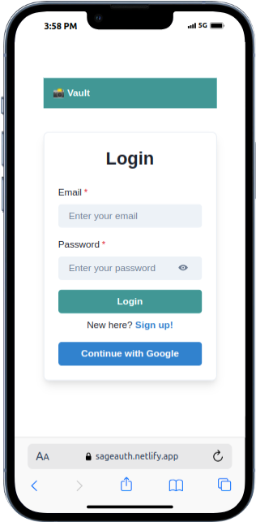

# Album Viewer

**Album Viewer** is a responsive web application that provides an intuitive platform for displaying user-related data and their associated albums, utilizing the [JSONPlaceholder API](https://jsonplaceholder.typicode.com/).

This application enables users to effortlessly navigate through user information, view album counts, and access individual album pages, ensuring a seamless experience across mobile, tablet, and desktop devices.

## Features

- **User Authentication:** Secure login via familiar auth providers (Google).
- **User List:** Displays all users along with the number of albums each user has.
- **User Albums:** View detailed information for a selected user, including their albums.
- **Album Details:** Access photos within an album, with functionality to edit photo titles.
- **Responsive Design:** Optimized for mobile, tablet, and desktop layouts.

## Technologies Used

- **Frontend Framework:** [React](https://react.dev/) with [TypeScript](https://www.typescriptlang.org/)
- **Build Tool:** [Vite](https://vitejs.dev/)
- **Styling:** [Chakra UI](https://v2.chakra-ui.com/)
- **Testing:** [Vitest](https://vitest.dev/) for unit testing components
- **State Management:** [Context API](https://react.dev/reference/react/useContext) for user authentication and data handling
- **Linting:** [ESLint](https://eslint.org/) configured to ensure code quality
- **Firebase:** For enabling Google Sign-In authentication and managing web application configurations, including environment settings for user authentication.
- **Google Cloud Console:** For managing cloud resources and permissions, allowing the application to interact with Firebase configurations when hosted on Netlify.

## Prerequisites

Before setting up the project, make sure you have the following installed:

- **Node.js**: Version 18 or higher is required. You can download it from [Node.js official website](https://nodejs.org/).
- **Yarn**: The project is built with Yarn, though npm can be used as an alternative. Install Yarn globally using npm:
  
  ```bash
  npm install --global yarn

## Installation

To setup the project locally, follow these steps:

1. Clone the repository:
   
   For **SSH**, use:

   ```bash
   git clone git@github.com:preston-56/vite-album-viewer.git
   ```

   For  **HTTPS**, use:
   ```bash
   git clone https://github.com/preston-56/vite-album-viewer.git
   ```
2. Navigate to the project directory:

   ```bash
   cd vite-album-viewer/frontend
   ```
3. Install dependencies:
   
   Using Yarn:

   ```bash
   yarn install
   ```
   Alternatively, using npm:
   ```bash
   npm install
   ```
4. Set Up Firebase Environment Variables:
   - Make sure to create a `.env` file in the root of your project(frontend) and add the following variables:
     ```plaintext
         VITE_API_KEY=YOUR_API_KEY
         VITE_AUTH_DOMAIN=YOUR_AUTH_DOMAIN
         VITE_PROJECT_ID=YOUR_PROJECT_ID
         VITE_STORAGE_BUCKET=YOUR_STORAGE_BUCKET
         VITE_MESSAGING_SENDER_ID=YOUR_MESSAGING_SENDER_ID
         VITE_APP_ID=YOUR_APP_ID
     ```

   - Replace `YOUR_API_KEY`, `YOUR_AUTH_DOMAIN`, `YOUR_PROJECT_ID`, `YOUR_STORAGE_BUCKET`, `YOUR_MESSAGING_SENDER_ID`, and `YOUR_APP_ID` with the actual values from your Firebase project credentials to enable Firebase services.


5. Running the application:

   Using Yarn:
   ```bash
   yarn dev
   ```
   Alternatively, using npm:
   ```bash
   npm run dev
   ```
## Testing
- The frontend includes [Vitest](https://vitest.dev/) as the testing framework to run tests for the components and ensure their functionality.
- These tests are located in the `src/test/` directory.
- To run the tests for the components(Home and Users), use:
  
  Using Yarn:
  ```bash
  yarn test
  ```
  Alternatively, using npm:
  ```bash
  npm run test
  ```
## Code Quality

- The project includes ESLint for maintaining code quality.
- To format your code, run:
  
  Using Yarn:
  ```bash
  yarn format
  ```
  Alternatively, using npm:
  ```bash
  npm run format
  ```

## Deployment

- This application (frontend) is hosted on [Netlify](https://www.netlify.com/) as a deployment service with a free tier.
- The deployment is automated through pipeline jobs to ensure seamless updates after checks have been met.
- The application can be accessed here: [live link](https://sageauth.netlify.app/home)

<div style="text-align: center;">
    <h4>Vault Album Viewer</h4>
    
    <p><a href="https://sageauth.netlify.app/home">View Application</a></p>
</div>
